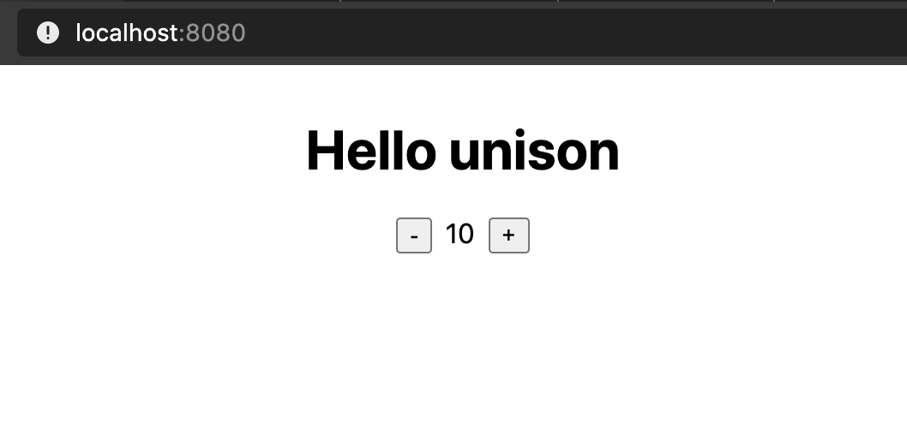

# unison.rs

An experimental runtime for unison code, written in rust, compiled to wasm for use in the browser.

## Usage:

- download the release binary
- run it! doesn't matter where.

## "Counter" interactive web example:

- in ucm, run `pull https://github.com/jaredly/unison-web-example .app_test`
- clone this repo (you'll need to have rust installed), and run `cargo run --release -- pack-all ~/.unison/v1/terms ./example/data/all.bin`
- in the `example` directory, run `yarn` to install dependencies, then `yarn serve`
- open `http://localhost:8080`!

## Dreamcode:

- download the binary, run `unison_rs pack-watch .my-app data/my-app.bin`
- run `yarn serve`
- hmmmmmmmm what if I have a quickstart that doesn't rely on webpack? because we've got everything prebuilt.... hmm.... yes.... probably want a rust server folks, yesiree

hmmm yeah the server could just "build on demand" probably?
- trigger a refresh
- it requests new data, and we server it up
- couldn't be simpler!
- what about javascript?
- recommend that people use unpkg, and type=module, right? seems reasonable.
- and have a published wasm bundle, right? yeah somewhere
- so user code could either be "nothing", and it uses a default index.html for playing around. or you point it to an html file, that fetches `/unison-bundle.bin` and `/unison-bundle.json`, and you're off to the races.

## Todo for UI:

- enter args, click "render"
- [x] some styling of the watchers section
- BUG if you delete a term that's being watched, everything dies
- a coherent color scheme
- and that's probably it for the moment?
- I do want to know why the random generation takes so darn long.